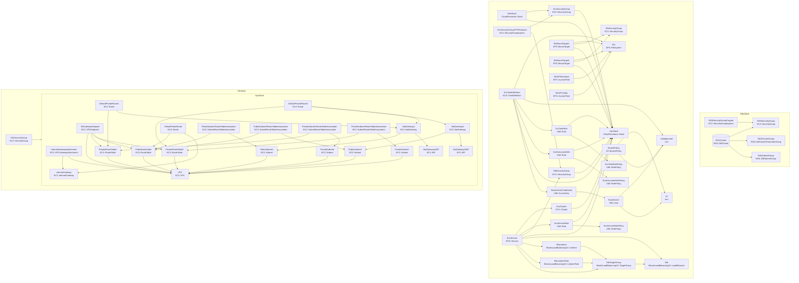

```mermaid
flowchart TB;
    subgraph VpcStack
        VpcStackInternetGatewayAttachment[InternetGatewayAttachment<br/>EC2::VPCGatewayAttachment]-->VpcStackInternetGateway[InternetGateway<br/>EC2::InternetGateway]
        VpcStackInternetGatewayAttachment[InternetGatewayAttachment<br/>EC2::VPCGatewayAttachment]-->VpcStackVPC[VPC<br/>EC2::VPC]
        VpcStackS3GatewayEndpoint[S3GatewayEndpoint<br/>EC2::VPCEndpoint]-->VpcStackVPC[VPC<br/>EC2::VPC]
        VpcStackS3GatewayEndpoint[S3GatewayEndpoint<br/>EC2::VPCEndpoint]-->VpcStackPrivateRouteTable1[PrivateRouteTable1<br/>EC2::RouteTable]
        VpcStackS3GatewayEndpoint[S3GatewayEndpoint<br/>EC2::VPCEndpoint]-->VpcStackPrivateRouteTable2[PrivateRouteTable2<br/>EC2::RouteTable]
        VpcStackS3GatewayEndpoint[S3GatewayEndpoint<br/>EC2::VPCEndpoint]-->VpcStackPublicRouteTable[PublicRouteTable<br/>EC2::RouteTable]
        VpcStackPublicSubnet1[PublicSubnet1<br/>EC2::Subnet]-->VpcStackVPC[VPC<br/>EC2::VPC]
        VpcStackPublicSubnet2[PublicSubnet2<br/>EC2::Subnet]-->VpcStackVPC[VPC<br/>EC2::VPC]
        VpcStackPrivateSubnet1[PrivateSubnet1<br/>EC2::Subnet]-->VpcStackVPC[VPC<br/>EC2::VPC]
        VpcStackPrivateSubnet2[PrivateSubnet2<br/>EC2::Subnet]-->VpcStackVPC[VPC<br/>EC2::VPC]
        VpcStackNatGateway1[NatGateway1<br/>EC2::NatGateway]-->VpcStackPublicSubnet1[PublicSubnet1<br/>EC2::Subnet]
        VpcStackNatGateway1[NatGateway1<br/>EC2::NatGateway]-->VpcStackNatGateway1EIP[NatGateway1EIP<br/>EC2::EIP]
        VpcStackNatGateway2[NatGateway2<br/>EC2::NatGateway]-->VpcStackPublicSubnet2[PublicSubnet2<br/>EC2::Subnet]
        VpcStackNatGateway2[NatGateway2<br/>EC2::NatGateway]-->VpcStackNatGateway2EIP[NatGateway2EIP<br/>EC2::EIP]
        VpcStackPublicRouteTable[PublicRouteTable<br/>EC2::RouteTable]-->VpcStackVPC[VPC<br/>EC2::VPC]
        VpcStackDefaultPublicRoute[DefaultPublicRoute<br/>EC2::Route]-->VpcStackPublicRouteTable[PublicRouteTable<br/>EC2::RouteTable]
        VpcStackDefaultPublicRoute[DefaultPublicRoute<br/>EC2::Route]-->VpcStackInternetGateway[InternetGateway<br/>EC2::InternetGateway]
        VpcStackPublicSubnet1RouteTableAssociation[PublicSubnet1RouteTableAssociation<br/>EC2::SubnetRouteTableAssociation]-->VpcStackPublicRouteTable[PublicRouteTable<br/>EC2::RouteTable]
        VpcStackPublicSubnet1RouteTableAssociation[PublicSubnet1RouteTableAssociation<br/>EC2::SubnetRouteTableAssociation]-->VpcStackPublicSubnet1[PublicSubnet1<br/>EC2::Subnet]
        VpcStackPublicSubnet2RouteTableAssociation[PublicSubnet2RouteTableAssociation<br/>EC2::SubnetRouteTableAssociation]-->VpcStackPublicRouteTable[PublicRouteTable<br/>EC2::RouteTable]
        VpcStackPublicSubnet2RouteTableAssociation[PublicSubnet2RouteTableAssociation<br/>EC2::SubnetRouteTableAssociation]-->VpcStackPublicSubnet2[PublicSubnet2<br/>EC2::Subnet]
        VpcStackPrivateRouteTable1[PrivateRouteTable1<br/>EC2::RouteTable]-->VpcStackVPC[VPC<br/>EC2::VPC]
        VpcStackDefaultPrivateRoute1[DefaultPrivateRoute1<br/>EC2::Route]-->VpcStackPrivateRouteTable1[PrivateRouteTable1<br/>EC2::RouteTable]
        VpcStackDefaultPrivateRoute1[DefaultPrivateRoute1<br/>EC2::Route]-->VpcStackNatGateway1[NatGateway1<br/>EC2::NatGateway]
        VpcStackPrivateSubnet1RouteTableAssociation[PrivateSubnet1RouteTableAssociation<br/>EC2::SubnetRouteTableAssociation]-->VpcStackPrivateRouteTable1[PrivateRouteTable1<br/>EC2::RouteTable]
        VpcStackPrivateSubnet1RouteTableAssociation[PrivateSubnet1RouteTableAssociation<br/>EC2::SubnetRouteTableAssociation]-->VpcStackPrivateSubnet1[PrivateSubnet1<br/>EC2::Subnet]
        VpcStackPrivateRouteTable2[PrivateRouteTable2<br/>EC2::RouteTable]-->VpcStackVPC[VPC<br/>EC2::VPC]
        VpcStackDefaultPrivateRoute2[DefaultPrivateRoute2<br/>EC2::Route]-->VpcStackPrivateRouteTable2[PrivateRouteTable2<br/>EC2::RouteTable]
        VpcStackDefaultPrivateRoute2[DefaultPrivateRoute2<br/>EC2::Route]-->VpcStackNatGateway2[NatGateway2<br/>EC2::NatGateway]
        VpcStackDefaultPrivateRoute2[DefaultPrivateRoute2<br/>EC2::Route]-->VpcStackNatGateway1[NatGateway1<br/>EC2::NatGateway]
        VpcStackPrivateSubnet2RouteTableAssociation[PrivateSubnet2RouteTableAssociation<br/>EC2::SubnetRouteTableAssociation]-->VpcStackPrivateRouteTable2[PrivateRouteTable2<br/>EC2::RouteTable]
        VpcStackPrivateSubnet2RouteTableAssociation[PrivateSubnet2RouteTableAssociation<br/>EC2::SubnetRouteTableAssociation]-->VpcStackPrivateSubnet2[PrivateSubnet2<br/>EC2::Subnet]
    end
    subgraph RdsStack
        RdsStackRDSSecurityGroupFargate[RDSSecurityGroupFargate<br/>EC2::SecurityGroupIngress]-->RdsStackRDSSecurityGroup[RDSSecurityGroup<br/>EC2::SecurityGroup]
        RdsStackRDSCluster[(RDSCluster<br/>RDS::DBCluster)]-->RdsStackRDSClusterGroup[RDSClusterGroup<br/>RDS::DBClusterParameterGroup]
        RdsStackRDSCluster[(RDSCluster<br/>RDS::DBCluster)]-->RdsStackRdsSubnetGroup[RdsSubnetGroup<br/>RDS::DBSubnetGroup]
        RdsStackRDSCluster[(RDSCluster<br/>RDS::DBCluster)]-->RdsStackRDSSecurityGroup[RDSSecurityGroup<br/>EC2::SecurityGroup]
    end
    subgraph &nbsp;
        rootRdsStack[RdsStack<br/>CloudFormation::Stack]-->rootEcsSecurityGroup[EcsSecurityGroup<br/>EC2::SecurityGroup]
        rootRdsStack[RdsStack<br/>CloudFormation::Stack]-->rootVpcStack[VpcStack<br/>CloudFormation::Stack]
        rootEcsSecurityGroup[EcsSecurityGroup<br/>EC2::SecurityGroup]-->rootVpcStack[VpcStack<br/>CloudFormation::Stack]
        rootEcsSecurityGroupHTTPinbound[EcsSecurityGroupHTTPinbound<br/>EC2::SecurityGroupIngress]-->rootEcsSecurityGroup[EcsSecurityGroup<br/>EC2::SecurityGroup]
        rootEcsSecurityGroupHTTPinbound[EcsSecurityGroupHTTPinbound<br/>EC2::SecurityGroupIngress]-->rootElbSecurityGroup[ElbSecurityGroup<br/>EC2::SecurityGroup]
        rootBucketUser[BucketUser<br/>IAM::User]-->roots3databucket[s3databucket<br/>rect]
        rootBucketUser[BucketUser<br/>IAM::User]-->roots3[s3<br/>rect]
        rootBucketUserCredentials[BucketUserCredentials<br/>IAM::AccessKey]-->rootBucketUser[BucketUser<br/>IAM::User]
        rootEfsMountTarget1[EfsMountTarget1<br/>EFS::MountTarget]-->rootEfs[Efs<br/>EFS::FileSystem]
        rootEfsMountTarget1[EfsMountTarget1<br/>EFS::MountTarget]-->rootEfsSecurityGroup[EfsSecurityGroup<br/>EC2::SecurityGroup]
        rootEfsMountTarget1[EfsMountTarget1<br/>EFS::MountTarget]-->rootVpcStack[VpcStack<br/>CloudFormation::Stack]
        rootEfsMountTarget2[EfsMountTarget2<br/>EFS::MountTarget]-->rootEfs[Efs<br/>EFS::FileSystem]
        rootEfsMountTarget2[EfsMountTarget2<br/>EFS::MountTarget]-->rootEfsSecurityGroup[EfsSecurityGroup<br/>EC2::SecurityGroup]
        rootEfsMountTarget2[EfsMountTarget2<br/>EFS::MountTarget]-->rootVpcStack[VpcStack<br/>CloudFormation::Stack]
        rootEfsAPNextcloud[EfsAPNextcloud<br/>EFS::AccessPoint]-->rootEfs[Efs<br/>EFS::FileSystem]
        rootEfsAPConfig[EfsAPConfig<br/>EFS::AccessPoint]-->rootEfs[Efs<br/>EFS::FileSystem]
        rootBucketPolicy[BucketPolicy<br/>S3::BucketPolicy]-->roots3[s3<br/>rect]
        rootBucketPolicy[BucketPolicy<br/>S3::BucketPolicy]-->roots3databucket[s3databucket<br/>rect]
        rootEcsServiceRole[EcsServiceRole<br/>IAM::Role]-->rootVpcStack[VpcStack<br/>CloudFormation::Stack]
        rootEcsTaskRole[EcsTaskRole<br/>IAM::Role]-->rootVpcStack[VpcStack<br/>CloudFormation::Stack]
        rootEcsExecutionRole[EcsExecutionRole<br/>IAM::Role]-->rootVpcStack[VpcStack<br/>CloudFormation::Stack]
        rootEcsServiceRole[EcsServiceRole<br/>IAM::Role]-->rootEcsServiceRolePolicy[EcsServiceRolePolicy<br/>IAM::RolePolicy]
        rootEcsTaskRole[EcsTaskRole<br/>IAM::Role]-->rootEcsTaskRolePolicy[EcsTaskRolePolicy<br/>IAM::RolePolicy]
        rootEcsExecutionRole[EcsExecutionRole<br/>IAM::Role]-->rootEcsExecutionRolePolicy[EcsExecutionRolePolicy<br/>IAM::RolePolicy]
        rootEcsCluster[EcsCluster<br/>ECS::Cluster]-->rootVpcStack[VpcStack<br/>CloudFormation::Stack]
        rootElbSecurityGroup[ElbSecurityGroup<br/>EC2::SecurityGroup]-->rootVpcStack[VpcStack<br/>CloudFormation::Stack]
        rootEcsTaskDefinition[EcsTaskDefinition<br/>ECS::TaskDefinition]-->rootEfs[Efs<br/>EFS::FileSystem]
        rootEcsTaskDefinition[EcsTaskDefinition<br/>ECS::TaskDefinition]-->roots3databucket[s3databucket<br/>rect]
        rootEcsTaskDefinition[EcsTaskDefinition<br/>ECS::TaskDefinition]-->rootEcsTaskRole[EcsTaskRole<br/>IAM::Role]
        rootEcsTaskDefinition[EcsTaskDefinition<br/>ECS::TaskDefinition]-->rootEcsExecutionRole[EcsExecutionRole<br/>IAM::Role]
        rootEcsTaskDefinition[EcsTaskDefinition<br/>ECS::TaskDefinition]-->rootVpcStack[VpcStack<br/>CloudFormation::Stack]
        rootEcsTaskDefinition[EcsTaskDefinition<br/>ECS::TaskDefinition]-->rootBucketUserCredentials[BucketUserCredentials<br/>IAM::AccessKey]
        rootEcsService[EcsService<br/>ECS::Service]-->rootEcsCluster[EcsCluster<br/>ECS::Cluster]
        rootEcsService[EcsService<br/>ECS::Service]-->rootEcsServiceRole[EcsServiceRole<br/>IAM::Role]
        rootEcsService[EcsService<br/>ECS::Service]-->rootElbSecurityGroup[ElbSecurityGroup<br/>EC2::SecurityGroup]
        rootEcsService[EcsService<br/>ECS::Service]-->rootVpcStack[VpcStack<br/>CloudFormation::Stack]
        rootEcsService[EcsService<br/>ECS::Service]-->rootElb[Elb<br/>ElasticLoadBalancingV2::LoadBalancer]
        rootEcsService[EcsService<br/>ECS::Service]-->rootElbListener[ElbListener<br/>ElasticLoadBalancingV2::Listener]
        rootEcsService[EcsService<br/>ECS::Service]-->rootElbListenerRule[ElbListenerRule<br/>ElasticLoadBalancingV2::ListenerRule]
        rootEcsService[EcsService<br/>ECS::Service]-->rootElbTargetGroup[ElbTargetGroup<br/>ElasticLoadBalancingV2::TargetGroup]
        rootElbTargetGroup[ElbTargetGroup<br/>ElasticLoadBalancingV2::TargetGroup]-->rootElb[Elb<br/>ElasticLoadBalancingV2::LoadBalancer]
        rootElbListener[ElbListener<br/>ElasticLoadBalancingV2::Listener]-->rootElbTargetGroup[ElbTargetGroup<br/>ElasticLoadBalancingV2::TargetGroup]
        rootElbListenerRule[ElbListenerRule<br/>ElasticLoadBalancingV2::ListenerRule]-->rootElbTargetGroup[ElbTargetGroup<br/>ElasticLoadBalancingV2::TargetGroup]
    end
    subgraph EfsStack
        EfsStackEfsSecurityGroup[EfsSecurityGroup<br/>EC2::SecurityGroup]-->VpcStack[VPC<br/>EC2::VPC]
    end
```
