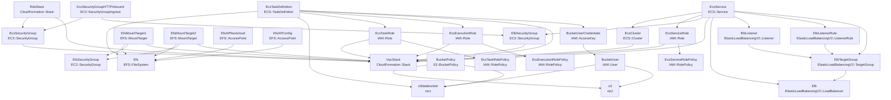

```mermaid
flowchart TB;
	rootRdsStack[RdsStack<br/>CloudFormation::Stack]-->rootEcsSecurityGroup[EcsSecurityGroup<br/>EC2::SecurityGroup]
	rootRdsStack[RdsStack<br/>CloudFormation::Stack]-->rootVpcStack[VpcStack<br/>CloudFormation::Stack]
	rootEcsSecurityGroup[EcsSecurityGroup<br/>EC2::SecurityGroup]-->rootVpcStack[VpcStack<br/>CloudFormation::Stack]
	rootEcsSecurityGroupHTTPinbound[EcsSecurityGroupHTTPinbound<br/>EC2::SecurityGroupIngress]-->rootEcsSecurityGroup[EcsSecurityGroup<br/>EC2::SecurityGroup]
	rootEcsSecurityGroupHTTPinbound[EcsSecurityGroupHTTPinbound<br/>EC2::SecurityGroupIngress]-->rootElbSecurityGroup[ElbSecurityGroup<br/>EC2::SecurityGroup]
	rootBucketUser[BucketUser<br/>IAM::User]-->roots3databucket[s3databucket<br/>rect]
	rootBucketUser[BucketUser<br/>IAM::User]-->roots3[s3<br/>rect]
	rootBucketUserCredentials[BucketUserCredentials<br/>IAM::AccessKey]-->rootBucketUser[BucketUser<br/>IAM::User]
	rootEfsMountTarget1[EfsMountTarget1<br/>EFS::MountTarget]-->rootEfs[Efs<br/>EFS::FileSystem]
	rootEfsMountTarget1[EfsMountTarget1<br/>EFS::MountTarget]-->rootEfsSecurityGroup[EfsSecurityGroup<br/>EC2::SecurityGroup]
	rootEfsMountTarget1[EfsMountTarget1<br/>EFS::MountTarget]-->rootVpcStack[VpcStack<br/>CloudFormation::Stack]
	rootEfsMountTarget2[EfsMountTarget2<br/>EFS::MountTarget]-->rootEfs[Efs<br/>EFS::FileSystem]
	rootEfsMountTarget2[EfsMountTarget2<br/>EFS::MountTarget]-->rootEfsSecurityGroup[EfsSecurityGroup<br/>EC2::SecurityGroup]
	rootEfsMountTarget2[EfsMountTarget2<br/>EFS::MountTarget]-->rootVpcStack[VpcStack<br/>CloudFormation::Stack]
	rootEfsAPNextcloud[EfsAPNextcloud<br/>EFS::AccessPoint]-->rootEfs[Efs<br/>EFS::FileSystem]
	rootEfsAPConfig[EfsAPConfig<br/>EFS::AccessPoint]-->rootEfs[Efs<br/>EFS::FileSystem]
	rootBucketPolicy[BucketPolicy<br/>S3::BucketPolicy]-->roots3[s3<br/>rect]
	rootBucketPolicy[BucketPolicy<br/>S3::BucketPolicy]-->roots3databucket[s3databucket<br/>rect]
	rootEcsServiceRole[EcsServiceRole<br/>IAM::Role]-->rootVpcStack[VpcStack<br/>CloudFormation::Stack]
	rootEcsTaskRole[EcsTaskRole<br/>IAM::Role]-->rootVpcStack[VpcStack<br/>CloudFormation::Stack]
	rootEcsExecutionRole[EcsExecutionRole<br/>IAM::Role]-->rootVpcStack[VpcStack<br/>CloudFormation::Stack]
	rootEcsServiceRole[EcsServiceRole<br/>IAM::Role]-->rootEcsServiceRolePolicy[EcsServiceRolePolicy<br/>IAM::RolePolicy]
	rootEcsTaskRole[EcsTaskRole<br/>IAM::Role]-->rootEcsTaskRolePolicy[EcsTaskRolePolicy<br/>IAM::RolePolicy]
	rootEcsExecutionRole[EcsExecutionRole<br/>IAM::Role]-->rootEcsExecutionRolePolicy[EcsExecutionRolePolicy<br/>IAM::RolePolicy]
	rootEcsCluster[EcsCluster<br/>ECS::Cluster]-->rootVpcStack[VpcStack<br/>CloudFormation::Stack]
	rootElbSecurityGroup[ElbSecurityGroup<br/>EC2::SecurityGroup]-->rootVpcStack[VpcStack<br/>CloudFormation::Stack]
	rootEcsTaskDefinition[EcsTaskDefinition<br/>ECS::TaskDefinition]-->rootEfs[Efs<br/>EFS::FileSystem]
	rootEcsTaskDefinition[EcsTaskDefinition<br/>ECS::TaskDefinition]-->roots3databucket[s3databucket<br/>rect]
	rootEcsTaskDefinition[EcsTaskDefinition<br/>ECS::TaskDefinition]-->rootEcsTaskRole[EcsTaskRole<br/>IAM::Role]
	rootEcsTaskDefinition[EcsTaskDefinition<br/>ECS::TaskDefinition]-->rootEcsExecutionRole[EcsExecutionRole<br/>IAM::Role]
	rootEcsTaskDefinition[EcsTaskDefinition<br/>ECS::TaskDefinition]-->rootVpcStack[VpcStack<br/>CloudFormation::Stack]
	rootEcsTaskDefinition[EcsTaskDefinition<br/>ECS::TaskDefinition]-->rootBucketUserCredentials[BucketUserCredentials<br/>IAM::AccessKey]
	rootEcsService[EcsService<br/>ECS::Service]-->rootEcsCluster[EcsCluster<br/>ECS::Cluster]
	rootEcsService[EcsService<br/>ECS::Service]-->rootEcsServiceRole[EcsServiceRole<br/>IAM::Role]
	rootEcsService[EcsService<br/>ECS::Service]-->rootElbSecurityGroup[ElbSecurityGroup<br/>EC2::SecurityGroup]
	rootEcsService[EcsService<br/>ECS::Service]-->rootVpcStack[VpcStack<br/>CloudFormation::Stack]
	rootEcsService[EcsService<br/>ECS::Service]-->rootElb[Elb<br/>ElasticLoadBalancingV2::LoadBalancer]
	rootEcsService[EcsService<br/>ECS::Service]-->rootElbListener[ElbListener<br/>ElasticLoadBalancingV2::Listener]
	rootEcsService[EcsService<br/>ECS::Service]-->rootElbListenerRule[ElbListenerRule<br/>ElasticLoadBalancingV2::ListenerRule]
	rootEcsService[EcsService<br/>ECS::Service]-->rootElbTargetGroup[ElbTargetGroup<br/>ElasticLoadBalancingV2::TargetGroup]
	rootElbTargetGroup[ElbTargetGroup<br/>ElasticLoadBalancingV2::TargetGroup]-->rootElb[Elb<br/>ElasticLoadBalancingV2::LoadBalancer]
	rootElbListener[ElbListener<br/>ElasticLoadBalancingV2::Listener]-->rootElbTargetGroup[ElbTargetGroup<br/>ElasticLoadBalancingV2::TargetGroup]
	rootElbListenerRule[ElbListenerRule<br/>ElasticLoadBalancingV2::ListenerRule]-->rootElbTargetGroup[ElbTargetGroup<br/>ElasticLoadBalancingV2::TargetGroup]
```